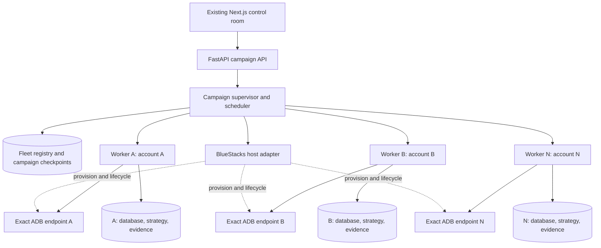
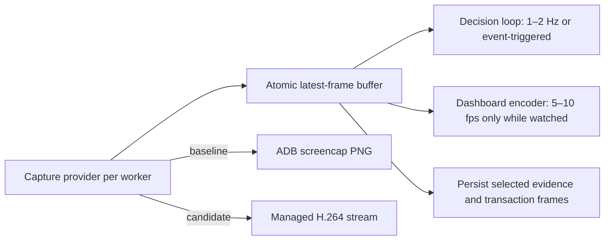
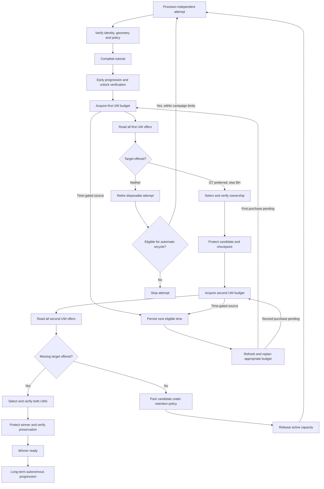
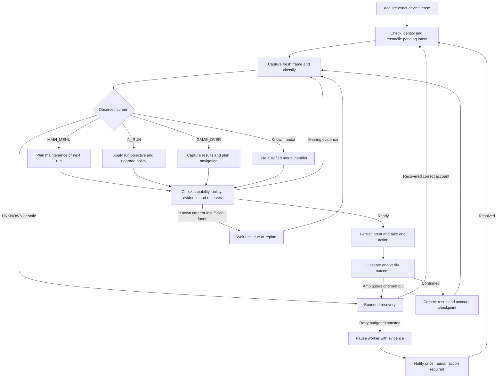

# Autonomous Tower bot and multi-instance reroll roadmap

Planning baseline: 16 September 2026, `main` at `2b03c3b3f074d4085573a7fff8a86c4363dc8f9d`.

This is a proposed roadmap, not a claim that these capabilities are implemented or qualified. It combines a source-code audit, the entire supplied Gemini summary, and the linked game guide. The full Gemini conversation was not supplied; it is only needed if the summary omits decisions or constraints. Instructions inside the attachment are treated as reference material, not implementation authorization.

## Recommendation

Extend the current Python/ADB bot, SQLite persistence, FastAPI API, and Next.js dashboard. Build a reliable single-account worker first, then put a campaign supervisor above isolated workers. Keep deterministic decision-making in the runtime; use language models offline to help curate versioned strategies and fixtures.

Deliver two outcomes separately:

1. **Reroll campaign:** progress independent disposable accounts, evaluate their Ultimate Weapon choices, preserve promising candidates, and stop with a verified Golden Tower + Black Hole account.
2. **Long-term autonomy:** continue the selected account with farming, research, spending, loadouts, events, tournaments, and eventually advanced builds.

Do not make the entire late-game optimizer a prerequisite for the first reroll campaign. Do not call a bot autonomous merely because it can repeat battles: it also needs bounded recovery, durable decisions, account isolation, and verified outcomes.

## What is already in the code

| Area | Audited current capability | Remaining gap |
|---|---|---|
| Device control | Background ADB screenshots and taps; configurable device endpoint | Exact identity binding, exclusive leases, reconnect/relaunch supervisor |
| Screen lifecycle | `MAIN_MENU`, `IN_RUN`, `GAME_OVER`, `UNKNOWN`, with transition confirmation | Tutorial, UW selection, event shop, tournament and recovery workflows |
| Farming | Battle upgrades, automatic run navigation, Workshop shopping, free claim flows | Broader purchase verification, objective-driven runs, resilient unattended operation |
| Account evidence | Account revisions separated from transient run observations | Complete readers and reliable account identity; unknown facts remain unknown |
| Transactions | Durable journal integrated into menu spending, evidence and ledger infrastructure | Coverage for every new action; reconciliation after interrupted actions |
| Progression | Objective graph, knowledge packs, affordability estimates, director dashboard | Director is explicitly advisory; it does not execute its recommendations |
| UWs | Typed records and a limited locked-screen reader | Offered choices, owned inventory, balances, selection and purchase verification |
| Labs/modules/cards | Models and partial readers; cards cover a limited empty-inventory case | Full live readers and qualified action workflows |
| Web application | FastAPI + Next.js, strategy controls, account inspector, runs/stats/ledger/director | Fleet overview, campaign policy, actionable incident controls, evidence-backed progression tree |
| Existing roadmap | 63 tasks; manifest reports 6 completed, 57 remaining | Reroll and fleet tracks are missing; partial implementations are not completed tasks |

Primary code anchors: [screen lifecycle](./screens.py), [runtime](./tower_bot.py), [device selection](./device.py), [account revisions](./account_state.py), [transaction journal](./transactions.py), [director](./director.py), [UW reader](./ultimate_weapons.py), [existing task status](./claude-code/tower-autonomy/STATUS.md).

### Fleet blockers found during the audit

- `device.py:62–65` falls back to `attached[0]` when the requested endpoint is absent. With multiple instances, that can control the wrong account. Fleet workers must fail closed instead.
- `AccountRepository.latest()` selects the latest revision across its database. An `account_id` field alone does not make the database safe to share between accounts.
- Strategy files and `.active` selection live in a shared directory; CLI overrides can persist into a profile. Separate `--db` and device ports are insufficient isolation.
- `run.sh:125–147` cleans up a port holder using `--port`, although the runtime uses that flag for the device endpoint and `--web-port` for the dashboard. A fleet launcher must not terminate another worker based on a shared default port.
- Device errors are logged and retried by the scan loop; this is not a bounded reconnect, app relaunch, or emulator recovery policy.
- The existing templates require 1080×2400 at 440 DPI. Validate this geometry after every emulator restart; arbitrary per-instance resolution is not supported today.

## How to use the Gemini proposals

| Proposal in the summary | Roadmap decision |
|---|---|
| Streamlit/Plotly analytics plus FastAPI/Next.js | Keep the existing FastAPI/Next.js application. Add analytics there; a second dashboard adds duplicate state and maintenance. |
| Duolingo-style milestone DAG | Reuse `objectives.py` and the director. Distinguish game progress from software implementation progress. |
| Completing a milestone enables a feature | Replace this coupling with separate observed unlock, implemented capability, qualification and policy permission. Checking a UI box cannot prove an in-game unlock. |
| Five-second feature flag cache | Optional later optimization. Critical spending validates current policy revision and fresh evidence; a TTL cache cannot be the authority. |
| Offline screenshot fixtures | Keep. Prefer captured, versioned frames from the supported emulator, including intermediate states and failures. Public screenshots supplement coverage after geometry/version labeling. |
| Relative ROIs, anchors, fuzzy OCR | Use anchors and calibrated transforms gradually. A 65% fuzzy name match is not sufficient evidence for an irreversible UW selection. |
| Deterministic JSON strategies | Keep. Version policies, record reasons, and replay decisions. Runtime latency must be measured; the summary's sub-millisecond claim is not an end-to-end benchmark. |
| Run/account statistics | Extend existing run and account storage instead of introducing a competing `tower_stats.db` schema. Capture terminal results plus checkpoints for interrupted runs. |
| Lifetime coins reconciliation | Treat as a consistency signal with tolerances, timestamps and other reward sources. `previous + run = current` is not universally exact. |
| Lifetime coins choose build archetype | Use alongside unlocks, research, inventory, performance and prerequisites. Lifetime coins alone do not justify a build transition. |
| ROI formulas | Useful scoring heuristics after affordability, reserves and prerequisites. Handle zero values, percentages, caps, synergies and objective-specific effects. |
| Exponential cost tables | Use verified, versioned per-stat data and displayed prices. Do not assume a universal exponential curve or that x10/x100 always buys the requested count. Prefix sums are appropriate only for validated tables. |

## Guide translation and limits

The [reroll guide](https://the-tower-idle-tower-defense.game-vault.net/wiki/Guide:Reroll_Guide), last edited in October 2024, proposes independent new accounts, early Turtle progression, Tier 1 wave 60 access to events/tournaments, and keeping an initial GT or BH while pursuing the pair. Its roughly four-hour/24-hour targets depend on luck and available rewards; they are not a service-level promise.

The [UW reference](https://the-tower-idle-tower-defense.game-vault.net/wiki/Ultimate_Weapons) describes three offered choices, first/second prices of 5/50 stones, and choices that persist when the menu is reopened. The bot must read all offers and choose deliberately. Closing and reopening the menu is not a new reroll.

The [event reference](https://the-tower-idle-tower-defense.game-vault.net/wiki/Events) lists 15-stone packs with increasing medal prices. The [daily mission reference](https://the-tower-idle-tower-defense.game-vault.net/wiki/Daily_Missions) lists time-gated mission arrivals and weekly stone rewards. Therefore, the planner needs observed availability, claim status, purchase index and next eligible time—not an assumption that missing stones can always be earned immediately.

These are community references, not live game measurements. Phase 0 validates the installed version. Store source, version, confidence and verification status with each rule; disagreement with the screen blocks that action and requests fresh evidence.

### Proposed campaign policy

- Target: verified ownership of both Golden Tower and Black Hole.
- First choice: choose GT if available; otherwise BH; otherwise retire the disposable attempt.
- Second choice: choose the missing member of the pair. If absent, park the candidate rather than accidentally spending on an unrelated weapon.
- Keep at least the best single-target fallback protected; other parked candidates follow an explicit retention/recycling policy. A second miss does not force destruction of a potentially valuable account.
- Reserve stones for the next selection. Avoid UW upgrades, unrelated event purchases and competing spending during the reroll phase.
- Early battle/Workshop strategy follows the guide's progression intent, translated into verified unlocks, affordable actions and stop conditions.
- Mission runs get explicit constraints, such as no cards, rather than fighting the ordinary farming profile.
- The current established account is protected and excluded from the disposable pool.
- Default planning scope: one winner, no real-money purchases, two active workers during qualification. Increase concurrency after measurement.
- Campaign-wide limits: maximum active workers, attempts, elapsed time, storage and currency spending. Reaching a limit becomes an explicit completed-without-winner or paused outcome.

## Architecture



Use one OS process per active worker initially. It fits the current single-device design, contains crashes, and allows separate OCR budgets. An in-process fleet would need more rework around mutable state and shared resources. Distributed workers can come later if one host cannot meet measured demand.

The supervisor allocates work, controls host capacity, handles lifecycle, and receives durable milestones. Workers own perception and all game taps. BlueStacks input mirroring is unsuitable for accounts that diverge after random choices and different run outcomes.

## Control-room UI

The current dashboard already provides the visual language to extend: a left navigation rail, an oversized live 9:16 device frame, an event feed, separate strategy/control pages, account evidence, ledger, errors and a read-only director. It is a single-worker cockpit today. The fleet UI adds a campaign level above it; it does not replace those account-level views.

The landing page becomes **Fleet**. Its primary object is an instance row rather than a chart: each row identifies the BlueStacks instance and account attempt, shows one durable campaign state, its current objective, last verified time and freshness. Selecting a row opens the selected instance's current frame with recognised regions/tap overlays, next permitted action, evidence freshness, last completed transaction and recovery status. The existing Live page remains the deep single-worker view.

| Page | Purpose | Primary decision |
|---|---|---|
| Fleet | Campaign health, worker capacity and incident visibility | Which worker or incident needs attention? |
| Instance | Live frame, event feed, current transaction and account facts | Is this worker behaving safely? |
| Candidates | Retained GT/BH candidates, ownership proof, next UW budget and retention policy | Which accounts are protected or eligible to recycle? |
| Campaign policy | Target pair, permitted spending, worker/attempt/time limits and protected accounts | What may run unattended? |
| Evidence | Captured frames, OCR readings, confidence and before/after transaction proof | Can a decision be trusted? |
| Incidents | Quarantined workers, recovery ladder, exact action needed and acknowledge/resume controls | Can this exception safely return to service? |

Only a campaign operator can create, pause, resume or stop a campaign and change policy. Routine rows are informational; they must never offer an unguarded "buy" or "recycle" button. An irreversible decision remains attributable to its policy revision, evidence and transaction record.

The Fleet page should surface a small set of live facts: active/capacity workers, protected candidates, next scheduled action, unresolved incidents and campaign limits. It should not present fabricated "efficiency" scores. A candidate timeline shows verified milestones only: first target owned, scheduled resource source, second offer observed, preserved winner. A worker failure is local and visibly quarantined while other rows continue.

The visual companion for this roadmap shows the intended hierarchy and an instance drill-down. It is a design target, not an implemented page.

## Capture and dashboard streaming

**Current behaviour:** `device.capture_screen()` calls `adbutils`' `screenshot()`, which executes `screencap -p` and decodes a PNG for every bot scan. The configured scan interval is two seconds. `FrameBuffer` then caches one JPEG encoding of that frame, and the web app already keeps an MJPEG connection open at `/api/frame`; its frame stream only sends when the bot publishes a new frame. In short: the browser connection is persistent, but the device capture is polling at the bot's cadence.

Adopt a **capture-provider boundary**, then benchmark both sources on the actual BlueStacks host:



The decision loop reads an immutable frame snapshot with a capture timestamp and sequence number. An action requires a recent frame and uses a frame captured after the preceding action; the scheduler may skip intermediate frames. The web UI gets a separately rate-limited preview and must never drive capture frequency. A worker with no browser viewers does not spend CPU encoding dashboard JPEGs.

Start with the existing PNG capture for functional qualification and measure per-worker capture latency, host CPU, emulator CPU, transfer size, OCR latency and action-to-verification latency at two and then four instances. If capture is material in the measured host limit, add a managed H.264 provider. Run the H.264 producer at 10–15 fps initially, retain only the latest decoded frame, execute policy at 1–2 Hz, and serve a 5–10 fps low-resolution dashboard preview. Do not assume 30/60 fps is useful for a turn-based UI or for OCR.

`scrcpy` is a strong candidate for the managed provider: its documented video path uses a persistent raw H.264 stream by default, can cap capture FPS and bitrate, and keeps separate video/control sockets. Its protocol is deliberately version-coupled to its server, so the bot should manage a pinned, matching `scrcpy` binary/server pair or use its supported client integration—not reimplement an undocumented raw socket protocol. H.264 does not guarantee a net CPU reduction on every BlueStacks configuration: it trades PNG encoding and repeated transfer for continuous emulator encoding plus host decode. The benchmark decides whether it is enabled per host.

The screenshot path remains the fallback and verification source until stream semantics are qualified. Each provider must expose: exact device identity, frame size/orientation, monotonically increasing sequence, capture timestamp, reconnect status and an explicit stale-frame signal. Stream reconnects, resolution changes and decode failures go through the same bounded recovery ladder; no stale stream frame may authorize a tap.

Every worker has explicit `host_id`, `instance_id`, `attempt_id`, `account_id` when observed, and a device lease. A new account on a reused emulator gets a new attempt and storage namespace. Device port is a transport address, not account identity. Before acting, verify the binding and reject duplicate/ambiguous aliases.

Proposed storage layout:

```text
runtime/
  fleet.sqlite
  attempts/<attempt-id>/
    bot.sqlite
    strategies/
    evidence/
    checkpoints/
```

Reuse current schemas inside each account database. Keep campaign/instance/lease/checkpoint records in the supervisor database. Aggregate worker summaries for the UI; do not make the current global-latest account repository silently multi-tenant.

Each durable action records intent, attempt/device binding, policy version, prerequisite evidence, expected result and deadline. Resume interrupted actions by observing the actual game state. A crash between tapping and recording the tap cannot be solved by blindly retrying. Telemetry can remain lossy; decisions, ownership changes and spending records cannot.

Connect the advisory director to a typed executor registry rather than allowing it to tap directly. An action proposal names the executor, target, currency, maximum cost, evidence revision, preconditions and expected postcondition. The dispatcher checks these against the worker's current state and campaign policy, executes one transaction step, then feeds verified results back into account state and the next plan. Reroll-specific objectives can use this same contract before the full late-game optimizer exists.

Persist maintenance due-times and distinguish requested, attempted and confirmed claims. The current runtime keeps some claim cadence in memory and advances it when a request is scheduled; that is insufficient to recover an interrupted maintenance visit reliably.

### BlueStacks feasibility

[BlueStacks Air documentation](https://support.bluestacks.com/hc/en-us/articles/34711762593037-How-to-create-and-manage-instances-using-the-Multi-instance-Manager-on-BlueStacks-Air) confirms fresh and cloned instances on Mac, plus batch lifecycle controls. This establishes product support; it does not establish a stable programmable cloning API or prove the installed machine can run the desired number of instances.

Working assumption pending platform confirmation: local Mac with BlueStacks Air. Keep a host-adapter boundary so BlueStacks 5 on Windows can be added without changing game policy.

Phase 0 must establish distinct ADB access, effective geometry and density, tap/capture correctness, and a tested lifecycle mechanism on the actual host. The Air instance creation documentation lists DPI choices different from the repo's required 440; verify effective device density and restart persistence instead of assuming the UI exposes the needed value.

Create a clean baseline with the game installed before account initialization. A cloned played account is not automatically an independent random attempt. Verify distinct account/session initialization in the game; if prelaunch cloning duplicates identity, use a qualified fresh-instance setup. A snapshot preserves an account—it does not reroll its saved choices.

Provisioning can start with a manually prepared pool, but **unbounded unattended rerolling is not complete until automatic replenish/reset is qualified**. If Air lifecycle automation is unavailable or brittle, retain the bounded pool mode and report that limitation explicitly. Account binding or interactive login challenges may remain exceptional human steps.

## Three separate state machines

Screen state answers “what is visible?” Account state answers “what does this account need?” Campaign state answers “which account should receive resources?” Keep these separate; a UW offer is a screen inside an account workflow, not an entire fleet state.

### Per-account reroll lifecycle



Unreadable or incomplete offers go to re-observation/recovery, never to the “no target” branch. All provisioning edges remain subject to global limits. Candidate protection precedes backup/binding attempts. The supervisor serializes winner election so simultaneous successes cannot overwrite each other; all confirmed winners remain protected.

### Worker execution and recovery



Recovery is a bounded ladder: recapture, recognized safe dismissal, reconnect the exact endpoint, resume/relaunch the game, then restart the same emulator through its adapter. Recheck identity and pending intents after every disruptive step. Unknown screens do not authorize arbitrary Back or close taps. Human pause/stop overrides the loop and releases resources only after durable checkpointing.

### Campaign lifecycle

`DRAFT → PREFLIGHT → RUNNING → WINNER_PRESERVED → COMPLETE`.

`RUNNING` can enter `PAUSED_BY_USER`, `WAITING_FOR_CAPACITY`, `WAITING_FOR_SOURCE`, `BLOCKED`, or `LIMIT_REACHED`. A worker failure normally isolates that worker; it does not stop healthy workers. A global identity/host fault or explicit stop pauses dispatch. On a verified winner, stop launching new attempts, preserve results and hand the selected account to long-term mode according to campaign policy.

## Delivery roadmap and acceptance gates

Each phase ends with evidence. Estimates should follow Phase 0 measurements; account progression time, calendar rewards and engineering time are different quantities.

| Phase | Deliverable | Existing work to extend | Exit gate |
|---|---|---|---|
| **0 — Establish the real baseline** | Confirm platform, game version, two unique instances, geometry, tutorial/offer/event captures, source-rule discrepancies, and PNG capture baseline | B01, B04, B08; new host feasibility work | Two instances can be independently identified and observed; required screens/lifecycle limitations and capture latency/CPU baseline documented |
| **1 — Isolate and recover workers** | Exact ADB binding, leases, per-attempt files, launcher isolation, heartbeats, checkpoints, bounded recovery, capture-provider benchmark | B05, B06, B07; new fleet isolation | Disconnect A: B receives no A command. Restart after an interrupted purchase: no blind repeat or cross-account state. Enable managed H.264 only if its measured host cost is lower and its recovery semantics pass qualification. |
| **2 — Autonomous fresh-account progression** | Tutorial handlers, early-game policy, unlock observation, complete run-to-maintenance cycle, blocked-overlay recovery | F01–F05, F08, B08; new tutorial workflow | Three fresh attempts independently reach verified access to required reward systems with no routine clicks |
| **3 — Earn and spend stones correctly** | Mission objectives, event reader/shop transaction, weekly claims, calendar-aware tournament workflow, reserves, explicit waiting | T01–T03, B07; narrowed campaign reward tasks | Complete a measured stone-acquisition route; verify claims/purchases once; unavailable rewards become scheduled waits |
| **4 — Single-worker reroll campaign** | Offer reader, deterministic picks, owned-UW verification, keep/reject policy, candidate protection, fresh replacement | U01 and a narrowly scoped UW selection executor; new campaign state machine | Replay every first/second offer branch, plus interrupted selection; live offered choice and persistence verified on a disposable account |
| **5 — Multi-instance campaign** | Resource scheduler, independent workers, automatic replenish, storage limits, fair scheduling, winner arbitration, fleet UI | New fleet track; O02–O05 | Two workers run for 24 hours within host budget; injected failure stays local; candidate/winner survives supervisor restart |
| **6 — Grow the winning account** | Continuous labs, perks, card/loadout management, module actions, tier optimization, UW sync, recurring events | L01–L04, F06–F09, C01–C05, U02–U03, T01–T04, E02–E07 | Selected account operates for seven days within policy; report intervention rate, missed timers, recovery and verified outcomes |
| **7 — Expand and maintain coverage** | Advanced builds, respecs, mastery/UW+, late-game systems, game-version regression handling | A01–A06, C06, U04–U05, T05–T06, V01–V07 | Capability-specific replay/live qualification before enabling each new executor |

Phases 0–5 are the reroll critical path. Basic runtime health and incident visibility ship in Phase 1; the fleet overview ships in Phase 5. Progression visuals can be added alongside these phases without delaying the core loop. Phase 6 is needed for the broader long-term autonomy goal, while Phase 7 is incremental coverage, not a prerequisite for a useful bot.

### Integrating with the existing 63-task plan

Preserve the existing task IDs and completion evidence. The phase table is a capability map, **not permission to bypass its dependency gates**. In particular, full U02 currently depends on U03 and E06, and T02 depends on E05; these encompass more than the minimal reroll path.

At the first implementation-planning step, explicitly split out narrower campaign contracts and update the dependency graph. Proposed additions:

| Proposed task | Scope | Required foundation |
|---|---|---|
| M01 | Exact instance registry, worker namespaces and exclusive device leases | B01/B03, device identity evidence |
| M03 | BlueStacks lifecycle and staged clone provisioning | M01, B05/B06, host feasibility evidence |
| R00 | On every clone, create a new Tower Account via Settings → Account → New Account and verify its unique Account ID | M01/M03, B05/B08, replay evidence |
| M05 | Qualify a clone source only after two R00-initialized clones prove distinct IDs and simultaneous sessions | M03/R00, host session evidence |
| M02 | Capture provider boundary and baseline benchmark | M01, host feasibility evidence |
| R01 | Tutorial and early-account progression | B04/B08, relevant F01–F04 execution coverage |
| R02 | Reroll-specific reward scheduling and medal-to-stone purchases | B05/B07, mission/event readers, R01 |
| R03 | First/second UW offer reading and verified target selection | B05/B07, U01 offer coverage, R02, qualified proposal checks |
| R04 | Candidate retention, winner preservation and restartable campaign | R03, M02, verified identity/preservation workflow |
| M03 | Capacity scheduling, worker restart isolation, duplicate-winner handling | M01/M02, R04, recovery qualification |
| O07 | Dashboard workflow to request fresh instances or qualified named clones through BlueStacks Multi-instance Manager | M03/M05, qualified BlueStacks clone adapter |
| M04 | Fleet control room, metrics, incident and qualification report | M03, O02–O05 foundations |

These narrower contracts retain affordability, identity, fresh evidence and transaction guards. They do not claim the full general-purpose U02/T02 task complete. The current manifest remains unchanged by this planning document.

The executable task list and dependency graph now live in [`claude-code/reroll-fleet/`](./claude-code/reroll-fleet/README.md). They are a separate package that resolves base prerequisites from `claude-code/tower-autonomy/manifest.json`, preserving the existing 63-task plan and allowing independent Claude Code sessions to work from either graph without duplicate task IDs.

## Minimal human intervention by design

At campaign creation, configure standing policy once: eligible disposable instances, protected accounts, preferred UW policy, resource limits, allowed purchases, recycle limits and winner handling. Routine actions inside that envelope require no repeated approval.

Human intervention is reserved for account/login challenges, an unrecognized interface after bounded recovery, unresolved identity or transaction evidence, and a requested action outside policy. Notifications should contain the instance, screenshot, last confirmed state, attempted recovery and specific next action. Deduplicate them until the incident changes.

Feature execution requires four independent conditions:

`observed game prerequisite + implemented reader/executor + qualification for this version + current policy permission`.

Unknown is not unlocked; disabled is not unsupported; completing a development task is not an account milestone. Show these distinctions in the progression UI. Derive capability status from registered executors and evidence where possible—the repository already contains support annotations that lag actual integrated claim handlers.

## Qualification and observability

Measure interventions per 24 worker-hours, unattended completion rate, confirmed transactions, recovery time, time to first/second UW budget, usable attempts per host-hour, candidates preserved, winner preservation, OCR freshness and resource consumption. The campaign optimizes verified progress per host-hour; more instances may reduce throughput if OCR or memory saturates.

Acceptance targets are proposed, not achieved measurements:

- Zero wrong-instance actions, protected-account resets, or unverified winner declarations in replay and qualification runs.
- All irreversible/new-currency workflows have a persisted intent and observable postcondition.
- Every wait has a reason and, where knowable, a next eligible timestamp; every retry has a deadline and bound.
- Begin with two workers; use measured CPU, memory and capture/OCR latency to decide whether three or four improve total throughput. Reserve capacity for recovery and preserve fairness for older candidates.
- Replay tutorial states, offers with either/both/neither target, unreadable choices, price changes, missing rewards, inventory changes, overlays, restart-before/after-tap and simultaneous winners.
- Inject endpoint disappearance/reuse, worker crash, stale frame, app exit, emulator restart, full disk and delayed persistence. Verify the worker cannot act under the wrong identity.
- Qualify preservation by restarting and re-observing the same candidate/winner. A screenshot alone is not a backup; cloud binding, where used, needs explicit confirmation without overwriting another account.
- Run only focused tests for changed contracts/files (`-p no:allure_pytest` for pytest), with an explicit long execution timeout. CI owns broad coverage.

## Suggested first implementation slice

Start with **exact device selection and per-worker runtime isolation**, including the launcher port mismatch. Prove that two workers cannot control each other's instance or overwrite strategy/state, then add recovery. In parallel with planning that slice, collect real tutorial, event and UW-choice frames from disposable accounts.

This unlocks reliable measurements and keeps the existing established account separate from reroll experiments. The next milestone is one account completing the full reroll workflow; scaling comes after that behavior is proven.

## Review record

- Pulled latest `main` with a fast-forward; preserved the pre-existing change to `strategies/default.json`.
- Read all of the supplied Gemini summary, inspected current implementation paths and the existing execution plan, and checked the linked guide and BlueStacks documentation.
- No bot was launched, no game account was modified, and no implementation tests or live qualification were run for this planning task.
- No commit, push, or task-completion status changes are part of this roadmap.
